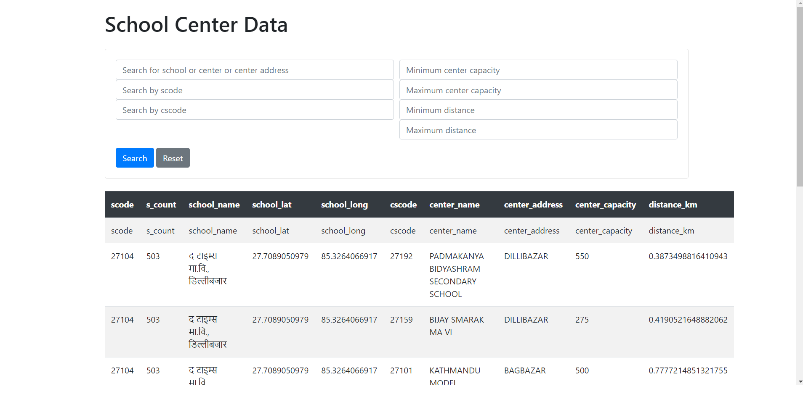

## What is this?

This is a server written in flask, which reads the "school-center-distance.tsv" data from the file and provides 
additional features like search, filter by min-max capacity, min-max distance, etc via webpage.   

## Usage
Please ensure you have run the "school_center.py" file, and ensure the tsv files are created inside the results folder. 
If not, you can create via following command:

```
python school_center.py ./sample_data/schools_grade12_2081.tsv ./sample_data/centers_grade12_2081.tsv ./sample_data/prefs.tsv
```

## Install all the packages:
Please make sure you are in the "server" directory:
```
cd server
```

Then, install all the packages:
```
pip install -r requirements.txt
```

## Run the server:
```
python app.py
```

